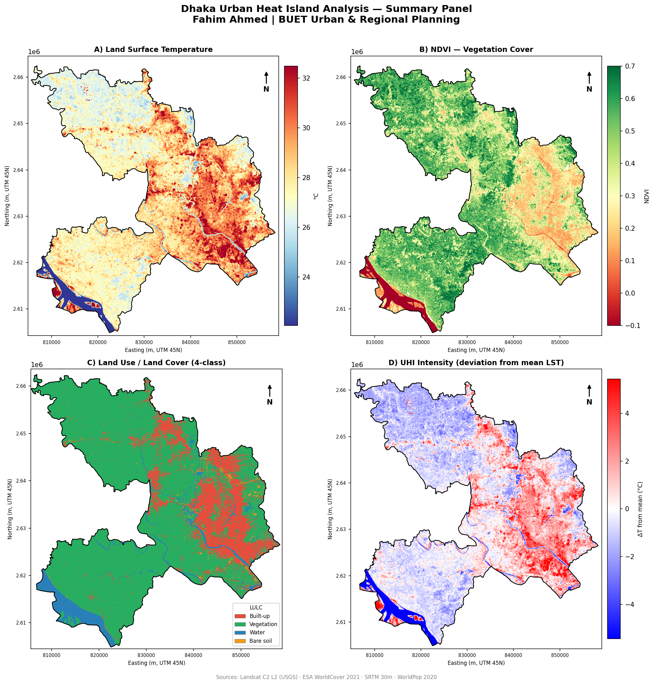
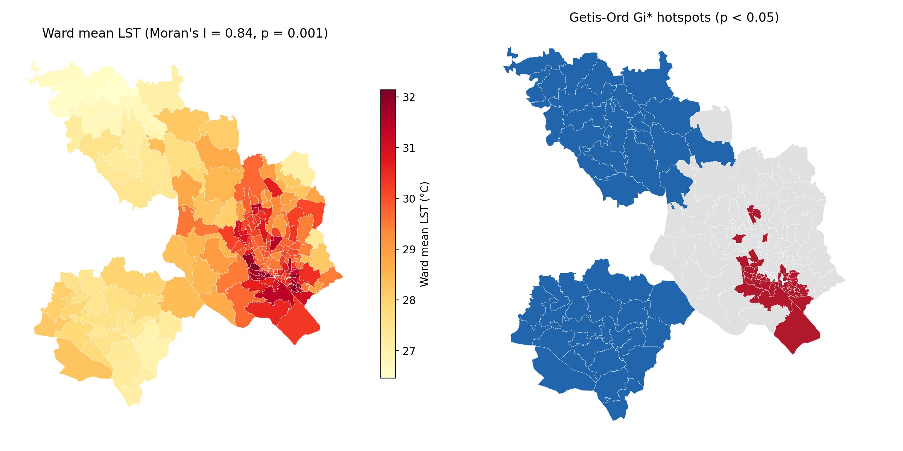
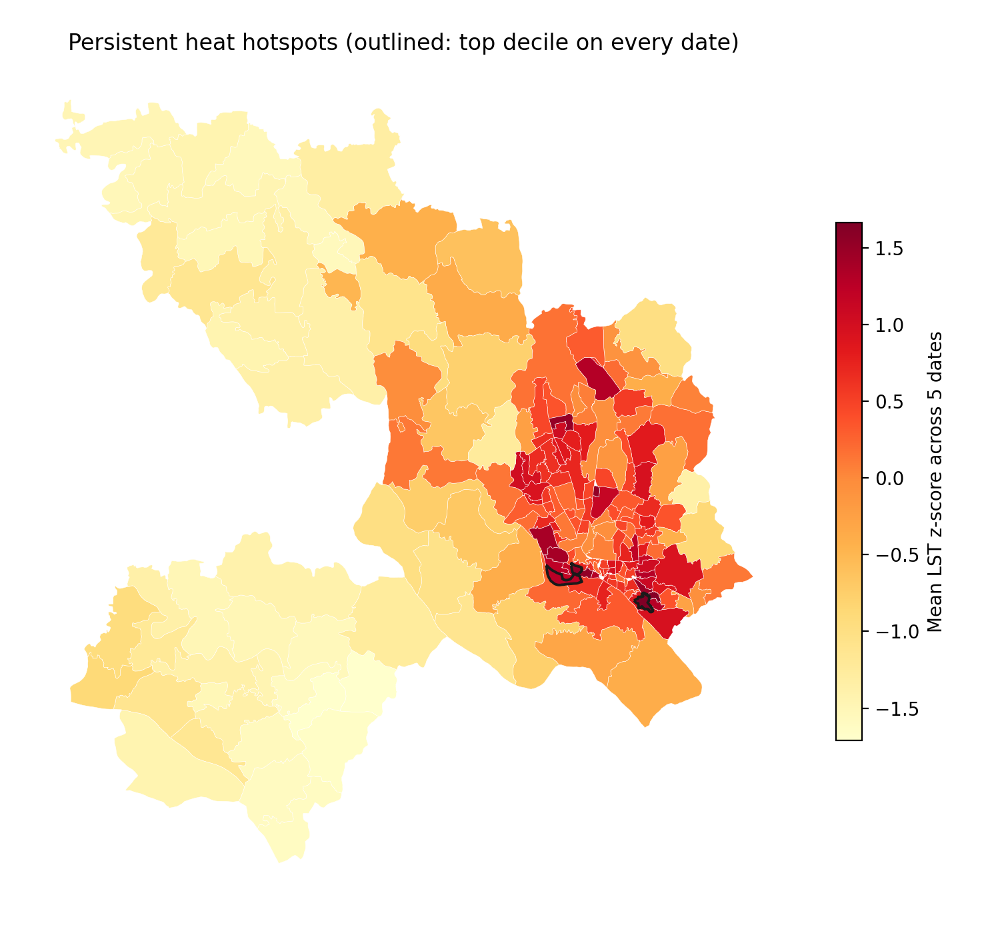
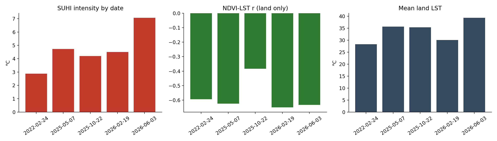
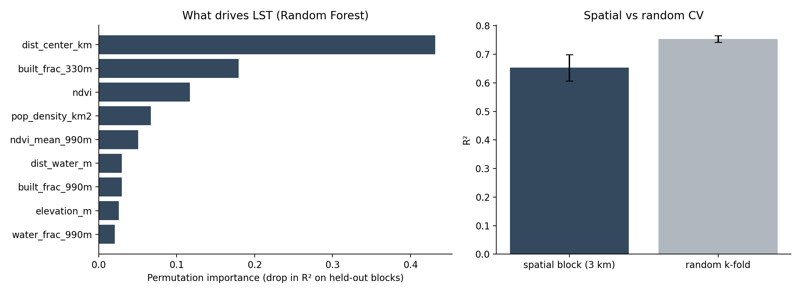
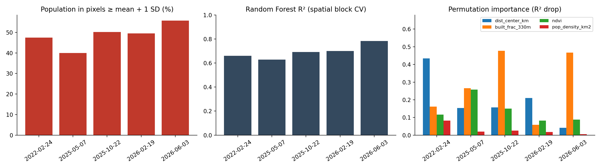
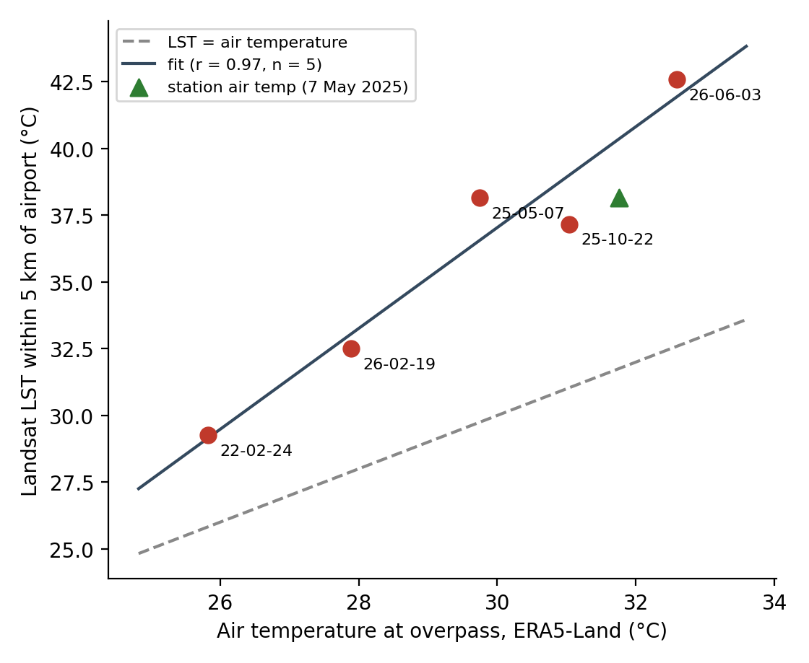

# Mapping Dhaka's surface heat island, from Landsat to ward level

**Fahim Ahmed** · Urban and Regional Planning, BUET
Python · rasterio · geopandas · scikit-learn · esda · Landsat 8/9 · ESA WorldCover · WorldPop



## The short version

I used free satellite data to measure how much hotter built-up Dhaka is than its green fringe, which wards stay hot in every season, and what explains the pattern. It is a reproducible pipeline of thirteen scripts, about 1,480 km² and 196 wards, five Landsat dates from February 2022 to June 2026.

| Question | Answer |
|---|---|
| How much hotter is the urban core than the rural reference? | **2.9 to 7.1 °C**, depending on the date (95% CI on the February 2022 scene: 2.6 to 3.1 °C) |
| Does vegetation cool the surface? | Yes. NDVI vs LST on land pixels: **r = -0.59 to -0.65** on four of five dates |
| Is the heat spatially random? | No. Ward Moran's I = **0.84** (p = 0.001); 45 hot and 45 cold wards at p < 0.05 |
| Which wards are always hot? | **Shyampur (Ward 90), Lalbagh (Ward 60), Sultanganj Kamrangir Char**: top 10% on all five dates, 81 to 99% built-up |
| How many people live in the hottest areas? | **40 to 56%** of the study-area population lives in pixels more than 1 SD above that date's mean LST, and **23 to 39%** in the hottest decile (WorldPop 2020; range over five dates) |
| What explains pixel temperature? | Local built-up share and NDVI in every warm-season scene. Distance from the centre dominates only in the dry February scene (importance 0.43, versus 0.04 to 0.21 on the other dates). Spatial-CV R² 0.63 to 0.78 |
| Does satellite LST match real air temperature? | It tracks it across seasons: **r = 0.97** against ERA5-Land air temperature at the overpass (n = 5 dates). LST runs 3 to 10 °C above air, the normal daytime offset. A NOAA station report on 7 May 2025 agrees (air 31.8 °C, LST 38.2 °C within 5 km of the airport) |

The heat island is not one number. Intensity ran from 2.9 °C in a dry February scene to 7.1 °C at monsoon onset, so a single-date figure would have been misleading.

## Maps and figures

| | |
|---|---|
|  |  |
| Ward mean LST and Gi* hotspots (24 Feb 2022) | Wards in the top decile on every date |
|  |  |
| SUHI, NDVI-LST correlation and mean LST by date | Random Forest driver ranking, spatial vs random CV (24 Feb 2022) |
|  |  |
| Exposure and drivers repeated on all five dates | LST against air temperature at the overpass |

## Dates used

| Date | Season | Sensor | Clear sky | Mean land LST | SUHI | NDVI-LST r |
|---|---|---|---|---|---|---|
| 2022-02-24 | dry | L9 | 99% | 28.3 °C | 2.9 °C | -0.59 |
| 2026-02-19 | dry | L9 | 95% | 30.1 °C | 4.5 °C | -0.65 |
| 2025-05-07 | pre-monsoon | L9 | 87% | 35.6 °C | 4.7 °C | -0.62 |
| 2026-06-03 | monsoon onset | L8 | 73% | 39.3 °C | 7.1 °C | -0.63 |
| 2025-10-22 | post-monsoon | L8 | 96% | 35.4 °C | 4.2 °C | -0.38 |

Three more scenes were rejected for cloud (10 Jul 2025: 0% clear; 27 Jun 2026: 51%; 9 Sep 2024: 53%). Dhaka is rarely visible from space in July and August, so mid-monsoon is a genuine gap.

## What went wrong the first time, and how I found it

My first version reported an NDVI-LST correlation of r = -0.07, which contradicts a large literature. I treated that as a bug report on my own work rather than a finding. Tracing it turned up seven separate problems:

1. Fill pixels were not masked, which produced -124 °C values and inflated every standard deviation.
2. An NDVI emissivity correction was applied to a surface temperature product that already includes one.
3. NDVI was computed from raw digital numbers; the reflectance offset (-0.2) does not cancel in the ratio.
4. Class codes and integer bands were resampled bilinearly, inventing classes at edges.
5. Water pixels (cool, NDVI at or below zero) were mixed into the regression and flipped its sign. Removing them moved r from -0.11 to -0.58.
6. No cloud or shadow mask.
7. The land-cover tile ended at 24 °N, leaving 4% of the study area without data.

The full before-and-after table is in [`CHANGELOG_v2.md`](CHANGELOG_v2.md). The first-version outputs are kept in `data/output_v1/` for comparison.

## Method in brief

- **LST** from Landsat Collection 2 Level-2 `ST_B10`, cloud, shadow, cirrus and snow masked with `QA_PIXEL` (flags grown 150 m). **NDVI** from surface reflectance.
- **SUHI** = mean LST of dense built-up land minus mean LST of rural vegetation with under 3% built-up cover nearby. Confidence interval from a spatial block bootstrap (3 km blocks).
- **Spatial statistics**: global Moran's I and Getis-Ord Gi* on ward means, 999 permutations.
- **Driver model**: Random Forest on 30 m pixels, scored with 3 km spatial block cross-validation (R² = 0.65). Random k-fold gives 0.75, which is how much ordinary splitting flatters the model.
- **Persistent hotspots**: wards in the top LST decile on every usable date.

Full write-up: [`METHODS_RESULTS_draft.md`](METHODS_RESULTS_draft.md).

## Limits worth knowing

- Daytime surface temperature at about 10:30 local time, not air temperature.
- Validation is thin: ERA5-Land is a 9 km reanalysis, not a station, and NOAA had a station report for only one of the five dates. With n = 5, r = 0.97 shows the seasonal signal is right, not that every pixel is.
- Five dates, no mid-monsoon coverage, so seasonal means are not estimated.
- Driver rankings change with season (see the robustness figure), so no single ranking should be quoted without its date.
- Distance from the centre is a proxy for building height, albedo and anthropogenic heat, which I did not measure.
- The 2004-2023 rainfall trend (`08_rainfall_analysis.py`) leans on one extreme year (2017) and is context only.

## Reproduce

```bash
pip install rasterio geopandas scipy scikit-learn libpysal esda matplotlib pandas pyproj
# put data under data/raw/ (see below), then
cd scripts
python 01_preprocess.py && python 02_lst_derivation.py && python 03_ndvi.py \
  && python 04_lulc_reclassify.py && python 05_zonal_stats.py && python 06_correlation.py
python 07_maps.py && python 08_rainfall_analysis.py
python 09_deep_analysis.py && python 10_multitemporal.py && python 11_persistent_hotspots.py
for d in 2022-02-24 2025-05-07 2025-10-22 2026-02-19 2026-06-03; do python 12_robustness.py $d; done
python 12_robustness.py --plot && python 13_validation.py
```

| Data | Source | Where it goes |
|---|---|---|
| Landsat 8/9 C2 L2 (`SR_B4`, `SR_B5`, `ST_B10`, `QA_PIXEL`, `MTL.txt`) | USGS or Microsoft Planetary Computer, path 137 row 44 | `data/raw/landsat/scene_NN_*/`, one folder per date |
| ESA WorldCover 2021 v200, tiles N21E090 and N24E090 | ESA | `data/raw/lulc/` |
| SRTM 30 m | USGS | `data/raw/dem/` |
| WorldPop 2020 | WorldPop | `data/raw/population/` |
| GADM 4.1 level 4 | GADM | `data/raw/admin/` |
| Rainfall 2004-2023 | NASA POWER | `data/raw/rainfall/` |

Raw rasters are not in the repository (several GB). `10_multitemporal.py` picks up every `scene_*` folder automatically.

## Repository layout

```
scripts/    01-13 numbered pipeline + uhi_common.py
data/output_v2/   figures and CSVs (current results)
data/output_v1/   first-version outputs, kept for comparison
CHANGELOG_v2.md   bug list and before/after numbers
METHODS_RESULTS_draft.md   write-up
```
